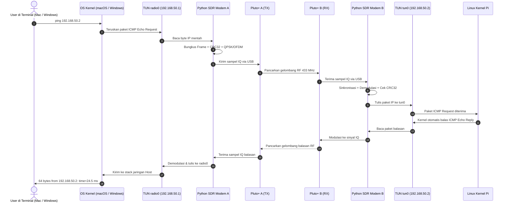

# 📡 Panduan Step-by-Step: Ping dari Node 1 (Mac / Windows) ke Node 2 (Raspberry Pi) via Pluto+ SDR

Panduan operasional lengkap dan ramah pengguna (*user-friendly*) untuk menghubungkan **Node 1 (Mac / Windows PC)** ke **Node 2 (Raspberry Pi)** melalui radio digital (**Pluto+ SDR**), mengalirkan paket ICMP (`ping`), dan mengukur performa link secara *cross-platform*.

> 🌐 **Tampilan Visual / Web Interaktif**: Anda juga dapat membuka file [**`STEP_PING_MAC_TO_PI.html`**](STEP_PING_MAC_TO_PI.html) atau simulator [**`preview.html`**](preview.html) langsung di browser untuk tampilan diagram Mermaid interaktif, switcher OS (Mac/Windows), tab visual, dan tombol *copy-to-clipboard* otomatis.
> 
> 🪟 **Pengguna Windows PC?** Silakan buka panduan khusus Windows di [**`STEP_PING_WINDOWS_TO_PI.md`**](STEP_PING_WINDOWS_TO_PI.md) atau versi interaktif [**`STEP_PING_WINDOWS_TO_PI.html`**](STEP_PING_WINDOWS_TO_PI.html).

---

## 🗺️ 1. Topologi Sistem & Aliran Data

### A. Diagram Topologi Jaringan & Perangkat Keras

```text
┌─────────────────────────────────────────────────────────────────────────────────────────────┐
│                                  TOPOLOGI FISIK SDR IP RADIO                                │
├───────────────────────────────────┬─────────────────────┬───────────────────────────────────┤
│       NODE 1 (MAC / WINDOWS)      │  JALUR RF (433 MHz) │       NODE 2 (RASPBERRY PI)       │
│  IP Radio: 192.168.50.1 / 24      │                     │  IP Radio: 192.168.50.2 / 24      │
├───────────────────────────────────┼─────────────────────┼───────────────────────────────────┤
│  [Terminal Mac / PowerShell Win]  │                     │  [Linux Kernel Network Stack]     │
│         │                         │                     │                 ▲                 │
│         ▼                         │                     │                 │                 │
│  Interface Virtual: radio0 / utun │                     │  Interface Virtual: radio0 / tun0 │
│  IP: 192.168.50.1                 │                     │  IP: 192.168.50.2                 │
│         │                         │                     │                 ▲                 │
│         ▼                         │                     │                 │                 │
│  Modem Python A (TX/RX)           │                     │  Modem Python B (RX/TX)           │
│  (QPSK, OFDM, CRC32, Framing)     │                     │  (Sync, Equalizer, Demod, CRC)    │
│         │                         │                     │                 ▲                 │
│         ▼ [USB: 192.168.2.10]     │                     │                 │ [USB: .2.10]    │
│  Pluto+ SDR A (192.168.2.1)       │                     │  Pluto+ SDR B (192.168.2.1)       │
│  Port TX (SMA) ───────────────────┼──► [Attenuator 30dB]┼──► Port RX (SMA)                  │
│                                   │    atau Antena OTA  │                                   │
└───────────────────────────────────┴─────────────────────┴───────────────────────────────────┘
                                       ▲               ▲
                                       │               │
                     [Jalur Remote Wi-Fi Lokal untuk Kontrol SSH]
                 Mac/Win PC ──► (ssh pi@raspberrypi.local) ──► Pi
```

---

### B. Diagram Blok Koneksi (Mermaid Preview)


---

### C. Aliran Siklus Paket Ping (Sequence Diagram)



---

## 🎯 2. Skema Alokasi IP Address

> [!CAUTION]
> **PENTING: JANGAN KELIRU ANTARA IP USB DENGAN IP RADIO!**
> * **`192.168.2.x`**: Khusus link kabel USB lokal antara host dan Pluto SDR miliknya masing-masing.
> * **`192.168.50.x`**: Jaringan virtual radio SDR antara Node 1 (Mac/Win) dan Node 2 (Pi).

| Lapisan Jaringan | Perangkat / Interface | Alamat IP | Keterangan |
|---|---|---|---|
| **USB Link 1 (Host)** | Mac / Windows USB Gadget Adapter | `192.168.2.10` | Link kabel USB PC ke Pluto A |
| **USB Link 1 (Host)** | Pluto+ SDR A Firmware | `192.168.2.1` | IP perangkat internal Pluto A |
| **USB Link 2 (Pi)** | Pi USB Gadget (`usb0`) | `192.168.2.10` | Link kabel USB Pi ke Pluto B |
| **USB Link 2 (Pi)** | Pluto+ SDR B Firmware | `192.168.2.1` | IP perangkat internal Pluto B |
| **RF Radio Link** | **Node 1 (Mac/Win) `radio0`** | **`192.168.50.1 / 24`** | **Alamat IP Radio Node 1 (Pengirim)** |
| **RF Radio Link** | **Node 2 (Pi) `radio0`** | **`192.168.50.2 / 24`** | **Alamat IP Radio Node 2 (Tujuan Ping)** |

---

## 🛠️ 3. Panduan Langkah Demi Langkah

### Persiapan Jendela Terminal (Dual Window)

Buka 2 jendela terminal / konsol di komputer Anda:
* **Jendela 1 (Node 1 Lokal)**: Terminal macOS atau PowerShell Windows.
* **Jendela 2 (Node 2 Remote)**: Sesi SSH ke Raspberry Pi via Wi-Fi lokal.

```bash
# Di Jendela 2, hubungkan SSH ke Raspberry Pi:
ssh pi@raspberrypi.local
```

---

### Langkah 1: Hubungkan & Konfigurasi Interface USB Pluto

#### 🍏 Jika Node 1 Menggunakan macOS:
1. Buka **System Settings** $\to$ **Network** $\to$ pilih **USB 10/100 LAN**.
2. Ubah IPv4 ke **Manually**:
   * **IP Address**: `192.168.2.10` | **Subnet Mask**: `255.255.255.0`
3. Tes koneksi lokal USB:
   ```bash
   ping -c 2 192.168.2.1
   ```

#### 🪟 Jika Node 1 Menggunakan Windows:
1. Download & install [PlutoSDR Windows USB Driver](https://wiki.analog.com/university/tools/pluto/drivers/windows).
2. Tekan `Win + R`, ketik `ncpa.cpl` lalu tekan Enter.
3. Klik kanan pada **PlutoSDR USB Ethernet/RNDIS Gadget** $\to$ **Properties**.
4. Klik ganda **Internet Protocol Version 4 (TCP/IPv4)**:
   * Pilih **Use the following IP address**:
   * **IP address**: `192.168.2.10` | **Subnet mask**: `255.255.255.0`
5. Tes koneksi di PowerShell:
   ```powershell
   ping 192.168.2.1
   ```

#### 📟 Di Node 2 (Raspberry Pi via SSH):
1. Aktifkan interface USB Pluto:
   ```bash
   sudo ifconfig usb0 192.168.2.10 netmask 255.255.255.0 up
   ```
2. Tes koneksi lokal USB:
   ```bash
   ping -c 2 192.168.2.1
   ```

---

### Langkah 2: Setup Environment & Deteksi Hardware (Stage 0)

#### 🍏 Opsi A: Node 1 menggunakan macOS
```bash
cd ~/GitHub/sdr-fullduplex/MeshNetworkSDR
python3 -m venv .venv
source .venv/bin/activate
pip install -r requirements.txt
pip install -e .
python scripts/detect_pluto.py
```

#### 🪟 Opsi B: Node 1 menggunakan Windows (PowerShell)
```powershell
cd MeshNetworkSDR
python -m venv .venv
.\.venv\Scripts\Activate.ps1
pip install -r requirements.txt
pip install -e .
python scripts\detect_pluto.py
```

#### 📟 Node 2 (Raspberry Pi via SSH)
```bash
cd ~/sdr-fullduplex/MeshNetworkSDR
python3 -m venv .venv
source .venv/bin/activate
pip install -r requirements.txt
pip install -e .
python scripts/detect_pluto.py
```

✅ **Hasil yang Diharapkan di Kedua Node:**
```text
================================
PLUTO SDR
================================
Status       : CONNECTED
URI          : ip:192.168.2.1
Model        : ADALM-PLUTO
TX channels  : OK
RX channels  : OK
Sample rate  : 2,000,000 SPS (2.00 MSPS)
================================
```

---

### Langkah 3: Uji Sinyal Gelombang RF (Stage 1)

1. **Di Node 2 (Pi - Receiver)**:
   ```bash
   python scripts/rx.py --freq 433000000
   ```
2. **Di Node 1 (Mac / Windows - Transmitter)**:
   * **macOS**: `python scripts/tx.py --tone --freq 433000000 --gain -20`
   * **Windows**: `python scripts\tx.py --tone --freq 433000000 --gain -20`
3. ✅ **Hasil**: Di layar Pi terlihat lonjakan sinyal dengan SNR di atas 20 dB.

---

### Langkah 4: Uji Paket Data Digital (Stage 2–5)

1. **Di Node 2 (Pi - Listening)**:
   ```bash
   python scripts/link.py --role rx
   ```
2. **Di Node 1 (Mac / Windows - Sending)**:
   * **macOS**: `python scripts/link.py --role tx --data "HELLO RASPBERRY PI"`
   * **Windows**: `python scripts\link.py --role tx --data "HELLO RASPBERRY PI"`
3. ✅ **Hasil**: Di layar Pi muncul payload `"HELLO RASPBERRY PI"` dengan status `CRC: OK`.

---

### Langkah 5: Mengaktifkan Interface Virtual Network `radio0` (Stage 7)

#### 📟 Di Node 2 (Raspberry Pi):
```bash
sudo .venv/bin/python -m pluto_radio.cli link --tun --ip 192.168.50.2/24
```
*(Interface `tun0` aktif di Pi dengan IP `192.168.50.2`)*

#### 🍏 Di Node 1 (macOS):
```bash
sudo .venv/bin/python -m pluto_radio.cli link --tun --ip 192.168.50.1/24
```
*(Interface `utun` aktif di Mac dengan IP `192.168.50.1`)*

#### 🪟 Di Node 1 (Windows - PowerShell Administrator):
```powershell
pluto-radio.exe link --tun --ip 192.168.50.1/24
```
*(Interface virtual Wintun / TAP aktif di Windows dengan IP `192.168.50.1`)*

---

### Langkah 6: Eksekusi Ping dari Node 1 ke Node 2 🎉

Buka tab konsol baru di komputer Node 1, lalu kirimkan paket ping ke alamat IP Radio Raspberry Pi:

* **macOS Terminal**:
  ```bash
  ping -c 5 192.168.50.2
  ```
* **Windows PowerShell / CMD**:
  ```powershell
  ping -n 5 192.168.50.2
  ```

✅ **Output Sukses:**
```text
PING 192.168.50.2 (192.168.50.2): 56 data bytes
64 bytes from 192.168.50.2: icmp_seq=0 ttl=64 time=26.418 ms
64 bytes from 192.168.50.2: icmp_seq=1 ttl=64 time=23.812 ms
64 bytes from 192.168.50.2: icmp_seq=2 ttl=64 time=24.501 ms
64 bytes from 192.168.50.2: icmp_seq=3 ttl=64 time=25.109 ms
64 bytes from 192.168.50.2: icmp_seq=4 ttl=64 time=24.780 ms

--- 192.168.50.2 ping statistics ---
5 packets transmitted, 5 packets received, 0.0% packet loss
round-trip min/avg/max/stddev = 23.812/24.924/26.418/0.852 ms
```

---

## 🩺 4. Tabel Diagnostik & Solusi Cepat (Cross-Platform)

| Gejala Masalah | Penyebab Utama | Solusi Praktis |
|---|---|---|
| `Request timeout` | Firewall di OS host memblokir ICMP Echo Request/Reply | **Di Pi**: `sudo ufw allow in on tun0`<br/>**Di Mac**: Izinkan ICMP di *Firewall Settings*.<br/>**Di Windows**: Jalankan di PowerShell Admin:<br/>`New-NetFirewallRule -DisplayName "Allow ICMPv4" -Protocol ICMPv4 -IcmpType 8 -Action Allow` |
| `Destination Host Unreachable` | Interface `radio0` belum aktif atau subnet beda | Pastikan Node 1 `192.168.50.1/24` dan Pi `192.168.50.2/24`. Cek dengan `ifconfig` (Mac), `ipconfig` (Win), atau `ip addr` (Pi). |
| Driver USB Pluto tidak terbaca di Windows | Driver RNDIS bawaan Windows belum terpasang | Install installer resmi: [PlutoSDR-M2k-USB-Drivers.exe](https://wiki.analog.com/university/tools/pluto/drivers/windows). Periksa di Device Manager. |
| `CRC Error` tinggi / Packet Loss | Sinyal terlalu kuat (*saturasi*) atau lemah | **Via kabel**: Pasang attenuator minimal 30 dB.<br/>**Via antena**: Jarak 1–2 meter, atur `tx_gain` ke `-20` dB. |
| `Device busy` saat buka Pluto | Proses Python SDR sebelumnya masih berjalan di background | **Linux/Mac**: `sudo pkill -f python`<br/>**Windows**: `Stop-Process -Name python -Force` |
