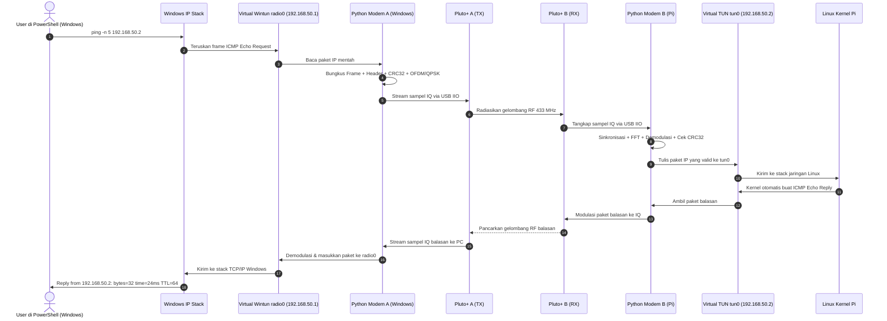

# 📡 Panduan Step-by-Step: Ping dari Node 1 (Windows PC) ke Node 2 (Raspberry Pi) via Pluto+ SDR

Panduan operasional lengkap, terperinci, dan ramah pengguna (*user-friendly*) khusus bagi pengguna **Windows 10 / Windows 11 PC (Node 1)** untuk terhubung ke **Raspberry Pi (Node 2)** melalui radio digital (**ADALM-Pluto / Pluto+ SDR**), mengalirkan paket ICMP (`ping`), dan memverifikasi koneksi point-to-point tanpa kabel LAN, Wi-Fi router, ataupun koneksi internet.

> 🌐 **Tampilan Visual & Simulator Web Interaktif**:
> * [**`STEP_PING_WINDOWS_TO_PI.html`**](STEP_PING_WINDOWS_TO_PI.html) — Panduan visual Windows dengan diagram Mermaid, status indikator, dan tombol copy otomatis.
> * [**`preview.html`**](preview.html) — Dashboard simulator live RF, IQ Constellation, dan Dual Terminal (Windows PowerShell vs Linux Pi).
> * 🍏 **Pengguna macOS?** Lihat panduan [**`STEP_PING_MAC_TO_PI.md`**](STEP_PING_MAC_TO_PI.md).

---

## 🗺️ 1. Topologi Sistem & Aliran Data

### A. Diagram Topologi Perangkat Keras & Jaringan

```text
┌─────────────────────────────────────────────────────────────────────────────────────────────┐
│                                  TOPOLOGI FISIK SDR IP RADIO                                │
├───────────────────────────────────┬─────────────────────┬───────────────────────────────────┤
│       NODE 1 (WINDOWS 10/11)      │  JALUR RF (433 MHz) │       NODE 2 (RASPBERRY PI)       │
│  IP Radio: 192.168.50.1 / 24      │                     │  IP Radio: 192.168.50.2 / 24      │
├───────────────────────────────────┼─────────────────────┼───────────────────────────────────┤
│  [Windows PowerShell (Admin)]     │                     │  [Linux Kernel Network Stack]     │
│         │                         │                     │                 ▲                 │
│         ▼                         │                     │                 │                 │
│  Interface Virtual: radio0        │                     │  Interface Virtual: radio0 / tun0 │
│  (Wintun / OpenVPN TAP Driver)    │                     │  IP: 192.168.50.2                 │
│  IP: 192.168.50.1                 │                     │                 ▲                 │
│         │                         │                     │                 │                 │
│         ▼                         │                     │                 │                 │
│  Modem Python A (TX/RX)           │                     │  Modem Python B (RX/TX)           │
│  (QPSK, OFDM, CRC32, Framing)     │                     │  (Sync, Equalizer, Demod, CRC)    │
│         │                         │                     │                 ▲                 │
│         ▼ [USB RNDIS: .2.10]      │                     │                 │ [USB usb0: .2.10] │
│  Pluto+ SDR A (192.168.2.1)       │                     │  Pluto+ SDR B (192.168.2.1)       │
│  Port TX (SMA) ───────────────────┼──► [Attenuator 30dB]┼──► Port RX (SMA)                  │
│                                   │    atau Antena OTA  │                                   │
└───────────────────────────────────┴─────────────────────┴───────────────────────────────────┘
                                       ▲               ▲
                                       │               │
                     [Jalur Remote Wi-Fi Lokal untuk Kontrol SSH]
                 Windows PC ──► (ssh pi@raspberrypi.local) ──► Pi
```

---

### B. Diagram Blok Arsitektur (Mermaid Flowchart)

```mermaid
graph LR
    subgraph N1 ["Node 1: Windows 10/11 PC"]
        direction TB
        WIN_APP["PowerShell / CMD (ping -n 5 192.168.50.2)"]
        WIN_TUN["Virtual Interface: radio0 (Wintun 192.168.50.1/24)"]
        WIN_MODEM["Modem Python (QPSK / OFDM Modulator)"]
        WIN_USB["USB RNDIS Gadget (192.168.2.10)"]
        WIN_APP --> WIN_TUN --> WIN_MODEM --> WIN_USB
    end

    subgraph S1 ["Pluto+ SDR A (Transmitter)"]
        SDR_A["Firmware Linux (192.168.2.1)"]
        TX_A["Port TX SMA"]
        SDR_A --> TX_A
    end

    subgraph RF ["Media Transmisi RF (433.000 MHz)"]
        RF_CH["Kabel Koaksial SMA + Attenuator 30 dB / Antena OTA"]
    end

    subgraph S2 ["Pluto+ SDR B (Receiver)"]
        RX_B["Port RX SMA"]
        SDR_B["Firmware Linux (192.168.2.1)"]
        RX_B --> SDR_B
    end

    subgraph N2 ["Node 2: Raspberry Pi (Responder)"]
        direction TB
        PI_USB["USB Gadget usb0 (192.168.2.10)"]
        PI_MODEM["Modem Python (Demodulator & CRC32)"]
        PI_TUN["Virtual TUN tun0 (192.168.50.2/24)"]
        PI_KERNEL["Kernel Linux (Auto ICMP Echo Reply)"]
        PI_USB --> PI_MODEM --> PI_TUN --> PI_KERNEL
    end

    WIN_USB ==> SDR_A
    TX_A -.-> RF_CH -.-> RX_B
    SDR_B ==> PI_USB
```



---

### C. Aliran Siklus Paket Ping Windows $\to$ Pi (Sequence Diagram)



---

## 🎯 2. Skema Alokasi IP Address

> [!CAUTION]
> **PENTING: JANGAN TERTUKAR ANTARA IP USB DENGAN IP RADIO!**
> * **Subnet USB (`192.168.2.x`)**: Jalur kabel USB fisik lokal antara PC/Pi ke Pluto SDR masing-masing. Jalur ini **tidak merutekan** trafik antar komputer.
> * **Subnet Radio Virtual (`192.168.50.x`)**: Jalur nirkabel digital point-to-point antara Node 1 (Windows) dan Node 2 (Raspberry Pi) yang menjadi target perintah `ping`.

| Segmen Jaringan | Perangkat / Adapter | Alamat IP | Subnet Mask | Fungsi |
|---|---|---|---|---|
| **USB Link 1 (Windows)** | Windows USB RNDIS Gadget | `192.168.2.10` | `255.255.255.0` | IP Host Windows untuk akses IIO |
| **USB Link 1 (Windows)** | Pluto+ SDR A (Firmware) | `192.168.2.1` | `255.255.255.0` | Port kontrol IIO internal Pluto A |
| **USB Link 2 (Pi)** | Pi USB Ethernet (`usb0`) | `192.168.2.10` | `255.255.255.0` | IP Host Pi untuk akses IIO |
| **USB Link 2 (Pi)** | Pluto+ SDR B (Firmware) | `192.168.2.1` | `255.255.255.0` | Port kontrol IIO internal Pluto B |
| **RF Mesh Link** | **Windows `radio0`** | **`192.168.50.1`** | **`255.255.255.0`** | **IP Radio Node 1 (Pengirim Ping)** |
| **RF Mesh Link** | **Raspberry Pi `radio0`** | **`192.168.50.2`** | **`255.255.255.0`** | **IP Radio Node 2 (Target Ping)** |

---

## 🧰 3. Pra-syarat Khusus Windows

Sebelum memulai, pastikan komponen berikut telah terpasang di Windows:

1. **Python 3.10+ (64-bit)**:
   * Download dari [python.org](https://www.python.org/downloads/).
   * ⚠️ **Centang kotak "Add Python to PATH"** saat instalasi!
2. **Driver USB PlutoSDR Windows**:
   * Download installer resmi dari Analog Devices: [**PlutoSDR-M2k-USB-Drivers.exe**](https://wiki.analog.com/university/tools/pluto/drivers/windows).
   * Jalankan file `.exe` dan ikuti wizard sampai selesai. Driver ini menyediakan komunikasi RNDIS Ethernet, VCP (Virtual COM Port), dan DFU.
3. **Microsoft Visual C++ Redistributable (x64)**:
   * Diperlukan oleh pustaka komputasi ilmiah `scipy` dan `numpy`. Download dari [Microsoft C++ Redistributables](https://learn.microsoft.com/en-us/cpp/windows/latest-supported-vc-redist).
4. **Driver Wintun (Otomatis untuk Stage 7)**:
   * Dibutuhkan untuk membuat interface virtual network TAP/TUN di Windows. Paket ini dapat diunduh otomatis atau via [wintun.net](https://www.wintun.net/).

---

## 🛠️ 4. Panduan Langkah Demi Langkah (Windows $\to$ Pi)

### Persiapan Jendela Konsol (Dual Window)

Buka 2 jendela terminal di komputer Windows Anda:
* **Jendela 1 (Lokal Windows)**: Buka **Windows Terminal** atau **PowerShell** as Administrator (`Win + X` $\to$ pilih **Terminal (Admin)**).
* **Jendela 2 (Remote Raspberry Pi)**: Buka tab PowerShell baru, lalu masuk ke Pi via SSH jaringan Wi-Fi lokal:
  ```powershell
  ssh pi@raspberrypi.local
  ```

---

### Langkah 1: Konfigurasi Interface USB Pluto di Windows

Setelah Pluto SDR A dihubungkan dengan kabel USB ke PC:

1. Tekan tombol **`Win + R`**, ketik **`ncpa.cpl`**, lalu tekan **Enter** untuk membuka *Network Connections*.
2. Cari adapter jaringan baru yang bernama **PlutoSDR USB Ethernet/RNDIS Gadget** (atau *Ethernet 2 / 3*).
3. Klik kanan pada adapter tersebut $\to$ pilih **Properties**.
4. Klik ganda pada **Internet Protocol Version 4 (TCP/IPv4)**.
5. Pilih **Use the following IP address**:
   * **IP address**: `192.168.2.10`
   * **Subnet mask**: `255.255.255.0`
   * Biarkan *Default gateway* dan *DNS* kosong.
   * Klik **OK** lalu **OK**.
6. Uji koneksi kabel USB di PowerShell:
   ```powershell
   ping 192.168.2.1
   ```
   Atau tes port IIO langsung:
   ```powershell
   Test-NetConnection -ComputerName 192.168.2.1 -Port 5337
   ```
   > Status harus menunjukkan `TcpTestSucceeded : True`.

#### Di Sisi Raspberry Pi (Jendela 2):
```bash
sudo ifconfig usb0 192.168.2.10 netmask 255.255.255.0 up
ping -c 2 192.168.2.1
```

---

### Langkah 2: Setup Python Virtual Environment di Windows

Buka **Jendela 1 (PowerShell)** di direktori proyek:

```powershell
# 1. Izinkan script PowerShell jika belum aktif
Set-ExecutionPolicy -ExecutionPolicy RemoteSigned -Scope Process

# 2. Masuk ke folder proyek
cd MeshNetworkSDR

# 3. Buat dan aktifkan virtual environment
python -m venv .venv
.\.venv\Scripts\Activate.ps1

# 4. Install dependensi radio
pip install -r requirements.txt
pip install -e .

# 5. Jalankan deteksi hardware Pluto SDR (Stage 0)
python scripts\detect_pluto.py
```

#### Di Sisi Raspberry Pi (Jendela 2):
```bash
cd ~/sdr-fullduplex/MeshNetworkSDR
python3 -m venv .venv
source .venv/bin/activate
pip install -r requirements.txt
pip install -e .
python scripts/detect_pluto.py
```

✅ **Output Sukses di Kedua Node:**
```text
================================
PLUTO SDR
================================
Status       : CONNECTED
URI          : ip:192.168.2.1
Model        : ADALM-PLUTO
TX channels  : OK
RX channels  : OK
Sample rate  : 2,000,000 SPS (2.00 MSPS)
================================
```

---

### Langkah 3: Konfigurasi Windows Firewall untuk Paket ICMP (Ping)

Windows Firewall secara default memblokir paket balasan ICMP echo dari subnet virtual. Jalankan perintah satu baris berikut di **PowerShell Administrator**:

```powershell
# Izinkan ICMP Echo Request dan Reply masuk di Windows
New-NetFirewallRule -DisplayName "Allow SDR ICMPv4 Ping" -Direction Inbound -Protocol ICMPv4 -IcmpType 8 -Action Allow
```

Di Sisi Raspberry Pi (Jendela 2):
```bash
# Izinkan trafik di interface virtual tun
sudo ufw allow in on tun0 2>/dev/null || true
```

---

### Langkah 4: Uji Sinyal Gelombang RF (Stage 1)

Verifikasi bahwa gelombang radio nirkabel 433 MHz dapat dipancarkan oleh Pluto A (Windows) dan diterima oleh Pluto B (Pi).

1. **Di Node 2 (Raspberry Pi - Receiver)**:
   ```bash
   python scripts/rx.py --freq 433000000
   ```
2. **Di Node 1 (Windows - Transmitter)**:
   ```powershell
   python scripts\tx.py --tone --freq 433000000 --gain -20
   ```
3. ✅ **Hasil**: Pada terminal Pi terlihat lonjakan sinyal RF dengan **SNR > 20 dB** dan RSSI yang stabil.

---

### Langkah 5: Uji Paket Data Digital (Stage 2–5)

Kirimkan frame paket data digital terenkapsulasi CRC32 melalui modulasi QPSK/OFDM.

1. **Di Node 2 (Raspberry Pi - Listening)**:
   ```bash
   python scripts/link.py --role rx
   ```
2. **Di Node 1 (Windows - Transmitting)**:
   ```powershell
   python scripts\link.py --role tx --data "HELLO PI FROM WINDOWS 11"
   ```
3. ✅ **Hasil**: Di terminal Pi muncul:
   ```text
   [RX] Packet Received: 24 bytes | Payload: "HELLO PI FROM WINDOWS 11" | CRC: OK
   ```

---

### Langkah 6: Mengaktifkan Interface Virtual Network `radio0` (Stage 7)

Kini kita hubungkan modem SDR ke stack jaringan sistem operasi menggunakan interface TUN/TAP.

#### Di Node 2 (Raspberry Pi):
```bash
sudo .venv/bin/python -m pluto_radio.cli link --tun --ip 192.168.50.2/24
```
*(Interface virtual `tun0` aktif dengan IP `192.168.50.2`)*

#### Di Node 1 (Windows - PowerShell Administrator):
```powershell
pluto-radio.exe link --tun --ip 192.168.50.1/24
```
*(Driver Wintun/TAP aktif di Windows dengan IP `192.168.50.1`)*

---

### Langkah 7: Eksekusi Ping dari Windows ke Raspberry Pi! 🎉

Buka tab PowerShell baru di Windows (biarkan proses `pluto-radio.exe link` tetap berjalan di background/tab sebelumnya), lalu kirimkan paket ping ke alamat IP Radio Pi:

```powershell
ping -n 5 192.168.50.2
```

✅ **Output Sukses di Konsol Windows:**
```text
Pinging 192.168.50.2 with 32 bytes of data:
Reply from 192.168.50.2: bytes=32 time=24ms TTL=64
Reply from 192.168.50.2: bytes=32 time=23ms TTL=64
Reply from 192.168.50.2: bytes=32 time=25ms TTL=64
Reply from 192.168.50.2: bytes=32 time=24ms TTL=64
Reply from 192.168.50.2: bytes=32 time=24ms TTL=64

Ping statistics for 192.168.50.2:
    Packets: Sent = 5, Received = 5, Lost = 0 (0% loss),
Approximate round trip times in milli-seconds:
    Minimum = 23ms, Maximum = 25ms, Average = 24ms
```

---

## 🩺 5. Diagnostik & Solusi Masalah Khusus Windows

| Gejala Masalah | Penyebab Utama | Solusi Praktis di Windows |
|---|---|---|
| **Driver Pluto tanda seru kuning di Device Manager** | Driver RNDIS bawaan Windows belum terpasang atau terblokir | Buka *Device Manager* $\to$ *Other Devices* $\to$ Klik kanan *PlutoSDR* $\to$ *Update Driver* $\to$ *Browse my computer* $\to$ *Let me pick* $\to$ Pilih **Network Adapters** $\to$ Pilih **Microsoft** $\to$ **Remote NDIS Compatible Device**. |
| **`ExecutionPolicy Restricted` saat aktivasi .venv** | Kebijakan keamanan script PowerShell Windows | Jalankan di PowerShell: `Set-ExecutionPolicy -ExecutionPolicy RemoteSigned -Scope CurrentUser`. |
| **`Request timed out` saat ping 192.168.50.2** | Windows Defender Firewall memblokir paket ICMP | Jalankan di PowerShell Admin:<br/>`New-NetFirewallRule -DisplayName "Allow ICMPv4" -Protocol ICMPv4 -IcmpType 8 -Action Allow` |
| **`libiio.dll not found` saat import pyadi-iio** | Pustaka C libiio belum terinstal di sistem Windows | Unduh installer binary resmi [libiio Windows Setup](https://github.com/analogdevicesinc/libiio/releases) dan pastikan folder `C:\Program Files\libiio` terdaftar di PATH Windows. |
| **`Destination Host Unreachable`** | Interface virtual Wintun belum diberi rute IP `192.168.50.1` | Cek via `ipconfig`. Jika IP radio0 belum muncul, tambahkan manual via PowerShell Admin:<br/>`netsh interface ipv4 set address name="radio0" static 192.168.50.1 255.255.255.0` |
| **Packet loss tinggi (> 20%)** | Sinyal saturasi (kabel tanpa peredam) atau interferensi ISM | Jika menggunakan kabel SMA, pasang attenuator 30 dB. Jika nirkabel, turunkan parameter gain transmisi: `--gain -30`. |
| **`Device or resource busy` di Windows** | Ada proses Python sebelumnya yang mengunci koneksi USB IIO | Matikan proses Python yang menggantung di PowerShell:<br/>`Stop-Process -Name python -Force` |

---

## 📚 Dokumen Terkait
* [**`STEP_PING_WINDOWS_TO_PI.html`**](STEP_PING_WINDOWS_TO_PI.html) — Versi visual interaktif dokumen ini.
* [**`STEP_PING_MAC_TO_PI.md`**](STEP_PING_MAC_TO_PI.md) — Panduan bagi pengguna Apple macOS.
* [**`preview.html`**](preview.html) — Simulator interaktif sinyal SDR & topologi.
* [**`command.md`**](command.md) — Daftar lengkap command cheat sheet Windows, Mac, dan Linux.
